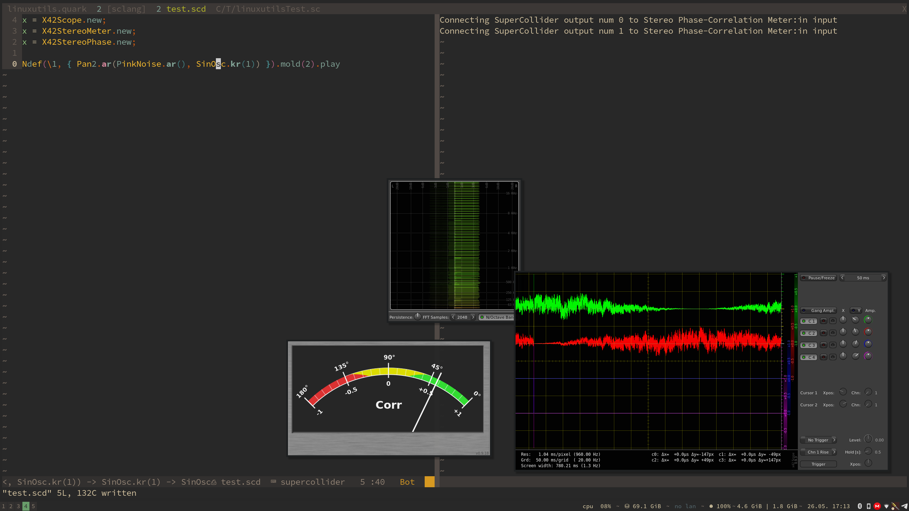

# LinuxUtils

Assorted linux based utilities and convenience functions for launching and connecting to Jack stuff automatically without leaving SuperCollider.

### Dependencies

- Linux
- Jack
- [X42 plugins](http://x42-plugins.com/x42/)
- [Jaaa and Japa](https://kokkinizita.linuxaudio.org/linuxaudio/)

### Install dependencies

#### Arch based distros

Using a AUR helper:
```
yay -S x42-plugins jaaa japa
```

#### Included

Convenience functions for starting up and connecting to the excellent Japa, Jaa and x42 meters and scopes:



```
// Open a ton of scopes
(
X42Scope.new;
X42StereoMeter.new;
X42StereoPhase.new;
X42GonioMeter.new;
X42PhaseWheel.new;
Jaaa.new;
Japa.new;
)

Ndef(\1, { Pan2.ar(PinkNoise.ar(), SinOsc.kr(1)) }).mold(2).play
```

### Installation

Open up SuperCollider and evaluate the following line of code:
`Quarks.install("https://github.com/madskjeldgaard/linuxutils-quark")`
